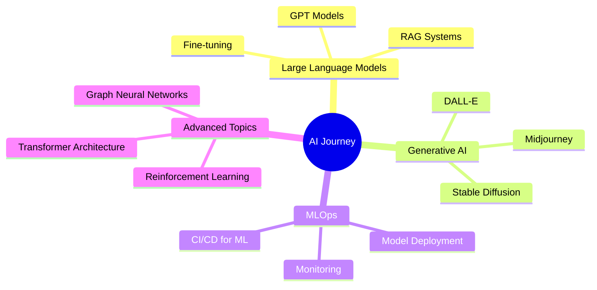

<div align="center">
  
</div>

<div align="center">
  
[](https://github.com/shivasai7775)
[](https://github.com/shivasai7775)
  
</div>

---

## 👨‍💻 About Me

```python
class AIEngineer:
    def __init__(self):
        self.name = "Shiva Sai"
        self.role = "AI Developer & Machine Learning Engineer"
        self.passion = ["Artificial Intelligence", "Deep Learning", "NLP", "Computer Vision"]
        self.currently_learning = ["Large Language Models", "Generative AI", "MLOps"]
        self.looking_to_collaborate = ["AI/ML Projects", "Open Source", "Research"]
        
    def say_hi(self):
        print("Thanks for stopping by! Let's build something amazing together!")

me = AIEngineer()
me.say_hi()
```

🔭 I'm a passionate **AI Developer** focused on creating intelligent systems that solve real-world problems. I love exploring cutting-edge AI technologies and implementing them in innovative ways.

💡 **What I Do:**
- Build and deploy Machine Learning models
- Develop Natural Language Processing solutions
- Create Computer Vision applications
- Implement Deep Learning architectures
- Optimize AI systems for production

---

## 🚀 Tech Stack

### Languages


### AI/ML Frameworks & Libraries


### Cloud & MLOps


### Web Development


### Databases


### Tools & Others


---

## 📊 GitHub Stats

<div align="center">
  
  
</div>

<div align="center">
  
  
</div>

---

## 🏆 GitHub Trophies

<div align="center">
  
</div>

---

## 💼 Featured Projects

<div align="center">

[](https://github.com/shivasai7775)
[](https://github.com/shivasai7775)

</div>

### 🤖 AI & Machine Learning Projects
- **🧠 Neural Network Framework** - Custom deep learning framework built from scratch
- **💬 NLP Chatbot** - Intelligent conversational AI with context understanding
- **👁️ Object Detection System** - Real-time object detection using YOLO
- **📊 Predictive Analytics** - ML models for business intelligence
- **🎨 Generative AI Art** - Creating art using GANs and diffusion models

---

## 🌱 Currently Exploring



---

## 📝 Latest Blog Posts

<!-- BLOG-POST-LIST:START -->
- 🤖 Building Production-Ready AI Applications
- 🚀 Optimizing ML Models for Edge Devices
- 💡 Understanding Transformer Architecture
- 🔧 MLOps Best Practices
- 📊 Data Science in the Real World
<!-- BLOG-POST-LIST:END -->

---

## 🤝 Let's Connect!

<div align="center">

[](https://linkedin.com/in/shivasai7775)
[](https://twitter.com/shivasai7775)
[](mailto:shivasai7775@gmail.com)
[](https://shivasai7775.github.io)
[](https://discord.com/users/shivasai7775)

</div>

---

## 💭 Random Dev Quote

<div align="center">
  


</div>

---

## 🐍 Contribution Snake

<div align="center">
  


</div>

---

<div align="center">
  
### ⭐️ From [shivasai7775](https://github.com/shivasai7775) with 💜

**"The best way to predict the future is to invent it." - Alan Kay**

</div>
